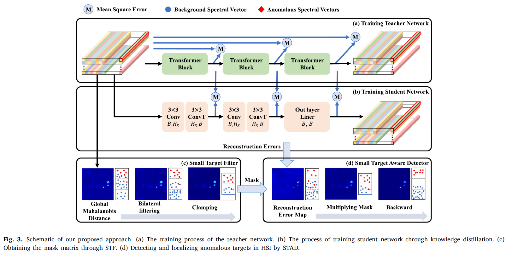
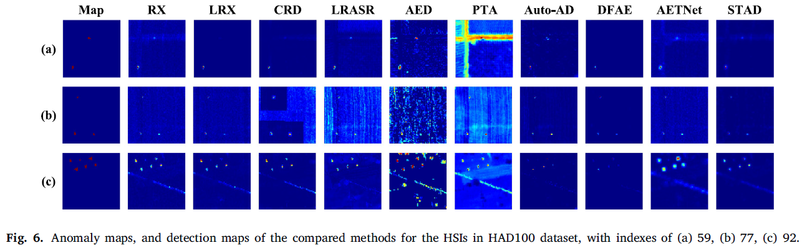

# STAD-HAD: Exploring hyperspectral anomaly detection with human vision: A small target aware detector

In Neural Networks

by Jitao Ma, Weiying Xie (Corresponding author), Yunsong Li of State Key Laboratory of Integrated Services Networks, Xidian University.

## Introduction

Hyperspectral anomaly detection (HAD) aims to localize pixel points whose spectral features differ from the background. HAD is essential in scenarios of unknown or camouflaged target features, such as water quality monitoring, crop growth monitoring and camouflaged target detection, where prior information of targets is difficult to obtain. Existing HAD methods aim to objectively detect and distinguish background and anomalous spectra, which can be achieved almost effortlessly by human perception. However, the underlying processes of human visual perception are thought to be quite complex. In this paper, we analyze hyperspectral image (HSI) features under human visual perception, and transfer the solution process of HAD to the more robust feature space for the first time. Specifically, we propose a small target aware detector (STAD), which introduces saliency maps to capture HSI features closer to human visual perception. STAD not only extracts more anomalous representations, but also reduces the impact of low-confidence regions through a proposed small target filter (STF). Furthermore, considering the possibility of HAD algorithms being applied to edge devices, we propose a full connected network to convolutional network knowledge distillation strategy. It can learn the spectral and spatial features of the HSI while lightening the network. We train the network on the HAD100 training set and validate the proposed method on the HAD100 test set. Our method provides a new solution space for HAD that is closer to human visual perception with high confidence. Sufficient experiments on real HSI with multiple method comparisons demonstrate the excellent performance and unique potential of the proposed method.

## Overview of STAD

## Main results

## BibTex Citation
@article{MA2025107036,
title = {Exploring hyperspectral anomaly detection with human vision: A small target aware detector},
journal = {Neural Networks},
volume = {184},
pages = {107036},
year = {2025},
issn = {0893-6080},
doi = {https://doi.org/10.1016/j.neunet.2024.107036},
url = {https://www.sciencedirect.com/science/article/pii/S0893608024009651},
author = {Jitao Ma and Weiying Xie and Yunsong Li},
}
